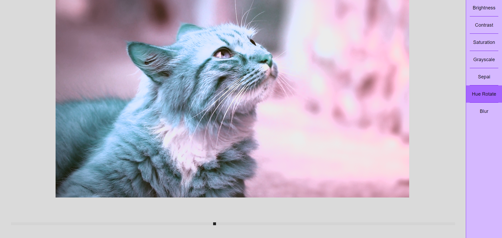

# PhotoEditor with React

This project is one of my React practice project. It is based from https://www.youtube.com/watch?v=J243ncoInNE&list=WL&index=10

### Todo
I want to add more features just for fun ;)
- choose file from local storage or url
- save image to various types
- Apply other computer vision process to the image (I haven't think about it yet Lol)

### Screenshot
